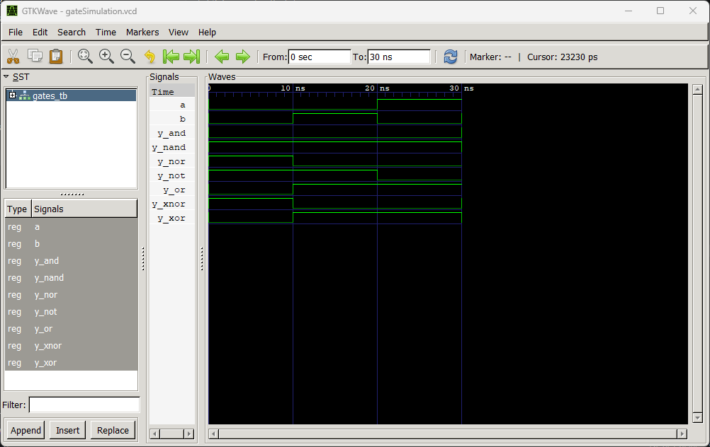

# **Lab 2: VHDL Code for Realizing Logic Gates**

## **Objective**
- To write VHDL code for basic logic gates: **AND, OR, NOT, NAND, NOR, XOR, and XNOR**.  
- To simulate each gate and verify its truth table using **GTKWave**.

## **Theory**
Logic gates are the fundamental building blocks of all digital circuits. Each gate performs a basic Boolean operation on one or more binary inputs to produce a single binary output.

| **Gate** | **VHDL Operator** | **Boolean Expression** |
|----------|-------------------|-------------------------|
| AND      | `and`             | Y = A · B              |
| OR       | `or`              | Y = A + B              |
| NOT      | `not`             | Y = A                  |
| NAND     | `nand`            | Y = A · B              |
| NOR      | `nor`             | Y = A + B              |
| XOR      | `xor`             | Y = A ⊕ B              |
| XNOR     | `xnor`            | Y = A ⊕ B              |

---

## **Expected Truth Table**

| A | B | AND | OR | NOT A | NAND | NOR | XOR | XNOR |
|---|---|-----|----|-------|------|-----|-----|------|
| 0 | 0 |  0  | 0  |   1   |  1   |  1  |  0  |  1   |
| 0 | 1 |  0  | 1  |   1   |  1   |  0  |  1  |  0   |
| 1 | 0 |  0  | 1  |   0   |  1   |  0  |  1  |  0   |
| 1 | 1 |  1  | 1  |   0   |  0   |  0  |  0  |  1   |

---

## **Output**

---

## **Discussion**
In this lab, we implemented **basic logic gates** in VHDL and verified their behavior using a **testbench**.  
- Each gate was instantiated as a separate entity (`AND_GATE`, `OR_GATE`, etc.).  
- The stimulus process applied all possible input combinations (`00, 01, 10, 11`).  
- The simulation produced a `.vcd` file, which was visualized in **GTKWave**.  
- The observed outputs matched the expected truth table for each gate.

This confirmed that the VHDL operators (`and`, `or`, `not`, etc.) correctly model the Boolean logic functions.

---

## **Conclusion**
The lab successfully demonstrated how to:  
- Write VHDL code for fundamental logic gates.  
- Create a testbench to apply input combinations.  
- Simulate and visualize outputs in GTKWave.  

The results validated the truth tables of all gates, establishing a strong foundation for designing more complex digital circuits in future labs.