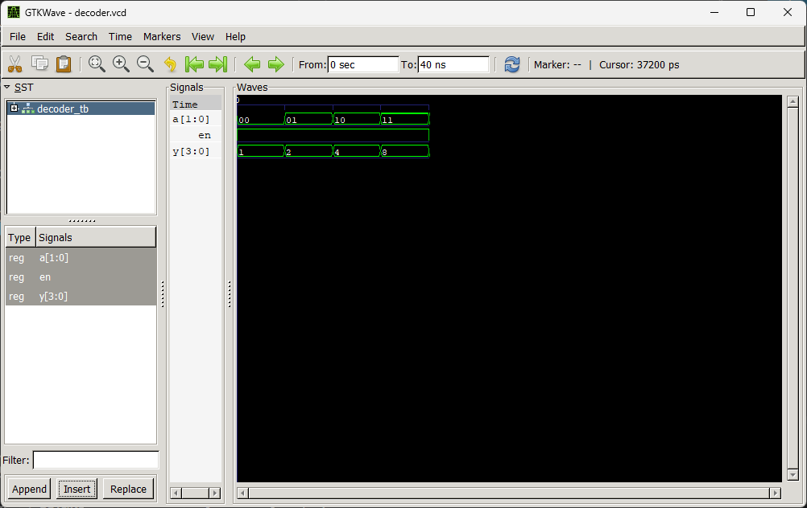
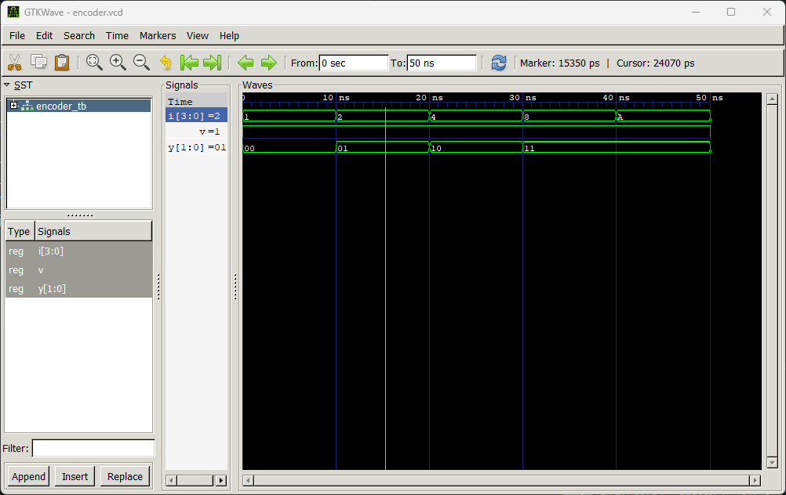

# **Lab 3: VHDL Code for Combinational Circuits (Encoder and Decoder)**

---

## **Objective**
- To design and simulate a **4-to-2 priority encoder** in VHDL.  
- To design and simulate a **2-to-4 decoder** in VHDL.  

---

## **Theory**

### **Encoder**
An **encoder** converts \(2^n\) input lines into an **n-bit binary code**.  
- Only one input is active (**HIGH**) at a time.  
- A **4-to-2 encoder** has 4 inputs (I0–I3) and produces a 2-bit output (Y1Y0).  
- A **priority encoder** resolves conflicts when multiple inputs are high by giving priority to the highest-numbered active input.  

**Truth Table (4-to-2 Priority Encoder):**

| I3 | I2 | I1 | I0 | Y1 | Y0 |
|----|----|----|----|----|----|
| 0  | 0  | 0  | 1  | 0  | 0  |
| 0  | 0  | 1  | X  | 0  | 1  |
| 0  | 1  | X  | X  | 1  | 0  |
| 1  | X  | X  | X  | 1  | 1  |

---

### **Decoder**
A **decoder** converts an **n-bit binary input** into one of \(2^n\) output lines.  
- A **2-to-4 decoder** has a 2-bit input (A1A0) and 4 outputs (Y0–Y3).  
- Exactly one output is **HIGH** at a time.  

**Truth Table (2-to-4 Decoder):**

| A1 | A0 | Y3 | Y2 | Y1 | Y0 |
|----|----|----|----|----|----|
| 0  | 0  | 1  | 0  | 0  | 0  |
| 0  | 1  | 0  | 1  | 0  | 0  |
| 1  | 0  | 0  | 0  | 1  | 0  |
| 1  | 1  | 0  | 0  | 0  | 1  |

---

## **Output**
**Decoder Output**

**Encoder Output**

---

## **Discussion**
In this lab, we implemented **two fundamental combinational circuits**:  
- The **priority encoder**, which demonstrated how multiple active inputs can be resolved by assigning priority.  
- The **decoder**, which showed how binary inputs can be expanded into multiple unique outputs.  

Key observations:
- The encoder correctly mapped active inputs to binary outputs, with higher inputs overriding lower ones.  
- The decoder successfully activated only one output line corresponding to the binary input.  
- Simulation waveforms confirmed the correctness of both designs.  

---

## **Conclusion**
This lab reinforced the concepts of **combinational logic design** in VHDL.  
We learned how to:  
- Write VHDL code for **encoder and decoder circuits**.  
- Create **testbenches** to apply input stimuli.  
- Run simulations and verify outputs using **GTKWave**.  

The results validated that both the **4-to-2 priority encoder** and **2-to-4 decoder** functioned as expected.  
This establishes a strong foundation for designing more complex combinational and sequential circuits in future labs.
